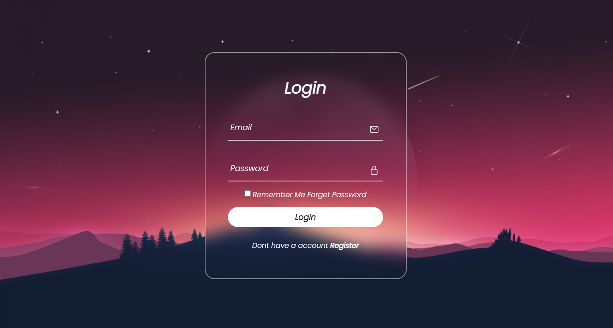
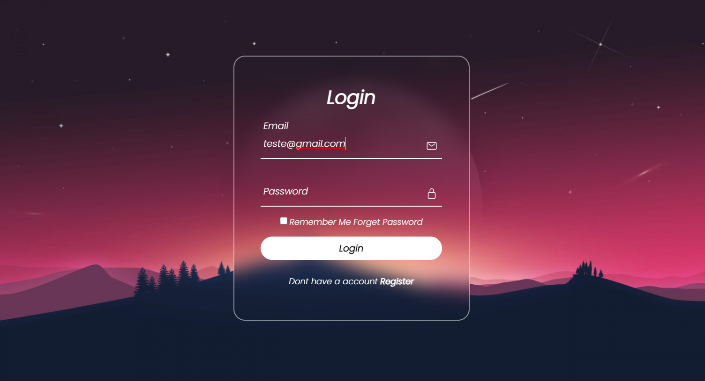

# Landpage_login_1

Uma landpage de login so para exericicio de criatividade.

 Documentação de cores

| Cor               | Hexadecimal                                                |
| ----------------- | ---------------------------------------------------------------- |
| Cor exemplo       |  #271e32 |
| Cor exemplo       |  #c04d67 |
| Cor exemplo       |  #792c4a |
| Cor exemplo       |  #948494 |

## 🛠 Habilidades
Javascript, HTML, CSS...

## Screenshots

## 🔗 Tecnologias

## Autores

- [@Komoss2](https://www.github.com/Kosmoss2)

## Licença

